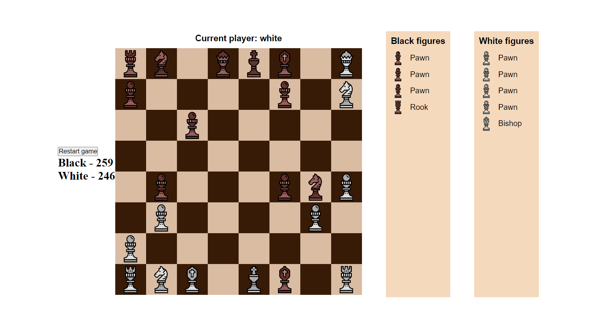

# Игра шахматы на TypeScript

### Цель

Познакомиться с TypeScript посредством написания игры в шахматы с использованием ООП.

### Концепция

Приложение представляет собой стандартную доску с шахматными фигурами. Игроки делают ход по очереди, на выполнение хода у игрока есть 300 секунд. При нажатии на шахматную фигуру, приложение показывает всевозожные ходы, а также при возможности "съесть" фигуру врага, подсвечивает её поле. Над шахматной доской отображается чей сейчас ход. Справа от доски находятся два списка выбывших фигур, который пополняется по мере игры.

### Технологии

* CRA
* React
* TypeScript
* OOP

### Скрин приложения 

### Запуск приложения

1. Скачать репозиторий
2. Установить зависимости проекта с помощью `npm install`
3. Запустите проект командой `npm start`

### Идеи по доработке

* Исправить баг первого хода пешки, если перед ней стоит фигура
* Выводить сообщение об окончании игры
* Запускать и останавливать таймер по кнопке
* Редизайн таймера
* Подсчёт количества ходов
* Возможность сделать один шаг назад и отменить его (то есть сделать шаг вперёд)
* Добавить условия для шаха и мата

### Возможно невозможно
* Усовершенствовать приложение: объединить данный проект с [chat-websocket](https://github.com/VincitQuiPatitur/chat-websocket) и реализовать игру в комнатах в режиме реального времени (использовать WebSocket)

